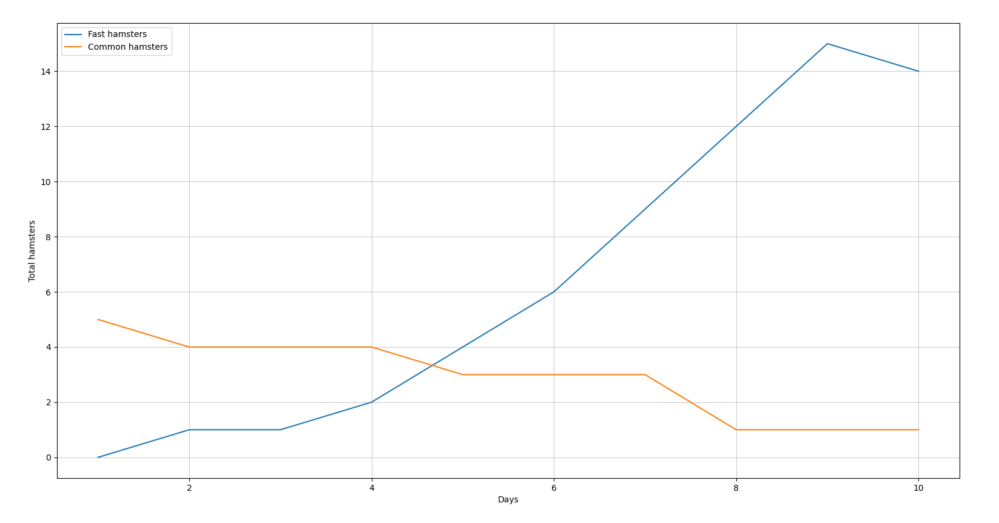
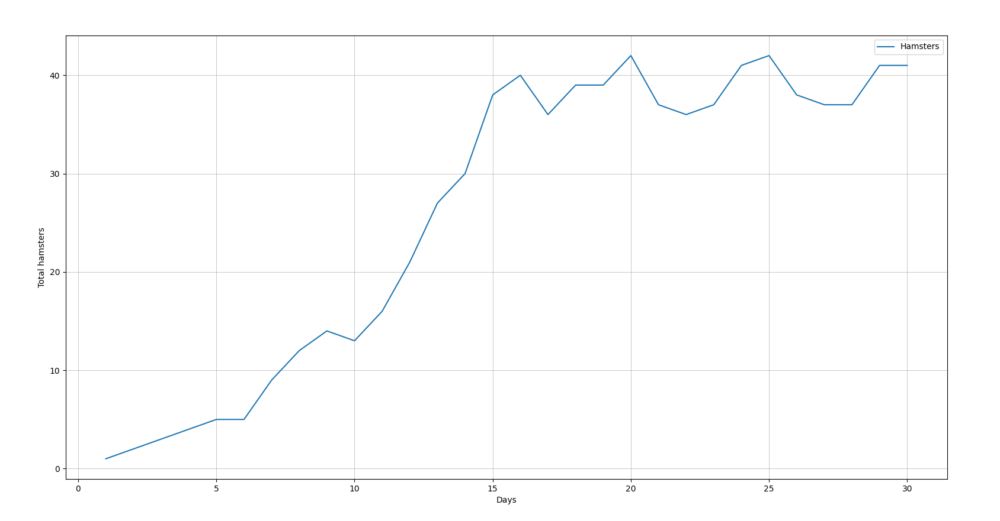
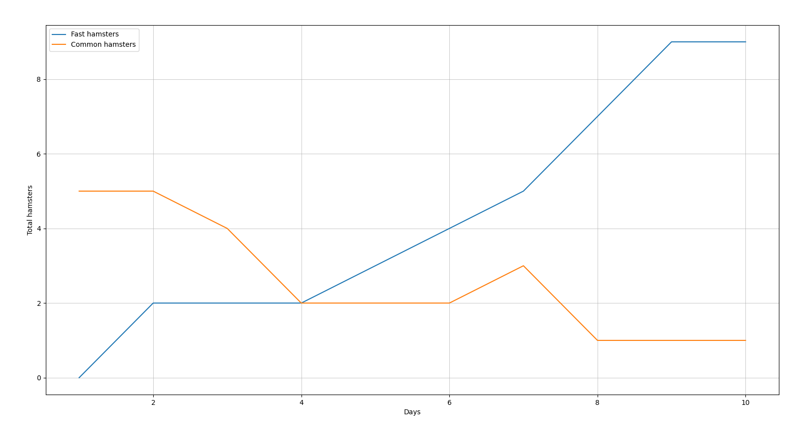
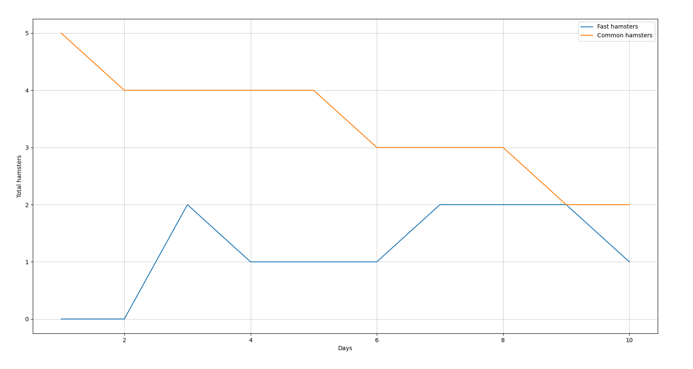
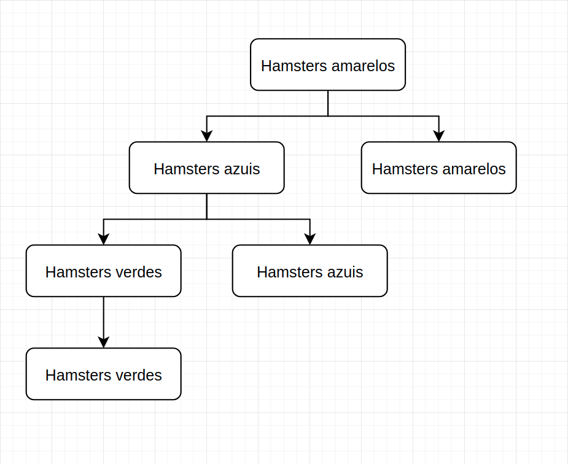
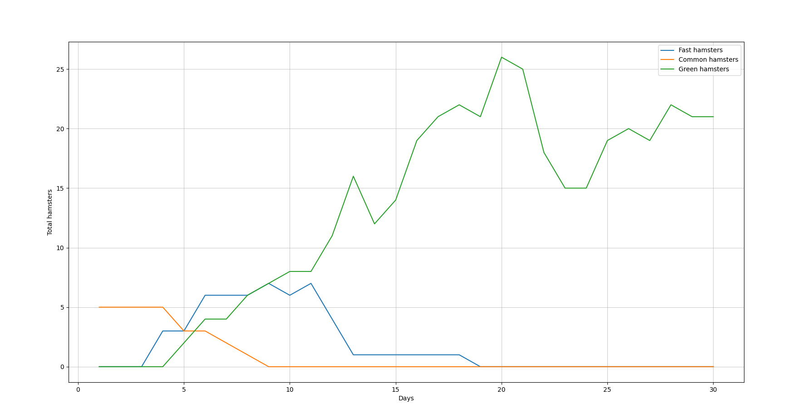
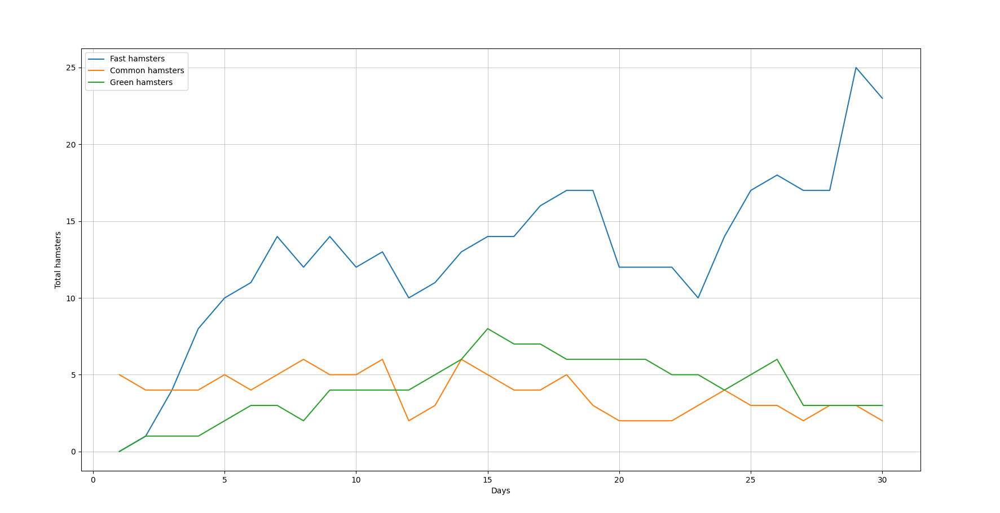

# Simulação da seleção natural

_Afinal, a seleção natural de Charles Darwin e Alfred Wallace já foi comprovada?_

Esse é um tema muito discutido no campo biológico. Enquanto muitos concordam e veem sentido nela, [outros discordam e discutem "buracos" encontrados no processo.](https://academic.oup.com/bioscience/article/64/4/355/248583)

## O que exatamente diz a seleção natural?

Segundo a [Wikipedia](https://en.wikipedia.org/wiki/Natural_selection), o conceito básico de seleção natural é que _características favoráveis que são
hereditárias tornam-se mais comuns em gerações sucessivas de uma população de organismos que se reproduzem, e que características desfavoráveis que são
hereditárias tornam-se menos comuns._

Isso significa que: uma determinada espécie tende a adquirir características vantajosas em um determinado ambiente. Um exemplo simples:

Imagine uma população de cobras onde 50% possuem as escamas da cor verde e os outros 50% possuem as escamas da cor vermelha. Imagine também que o solo onde essas 
cobras habitam seja da cor verde, ou seja, da mesma cor que as cobras de escamas verde.

Todos os dias, gaviões saem para caçar cobras. As cobras vermelhas são claramente mais fáceis de serem vistas pelos gaviões. Isso signifca que, por consequência, mais cobras vermelhas
serão mortas. Tendo isso em mente, passado determinado período as cobras verdes terão uma população maior e, consequentemente, irão reproduzir com mais frequência.   

Conforme o tempo avança, a população de cobras da cor vermelha ficará cada vez menor e, mesmo que elas reproduzam, acabarão sendo mortas pelos gaviões no futuro. É muito fácil ver o desfecho dessa história: depois
de determinado período, apenas a população de cobras da cor verde predominará.

Isso prova que uma determinada espécie irá adquirir e manter características vantajosas dependendo do ambiente. Para provar esse conceito, aqui vai uma pequena e simples simulação:

Imagine que as bolinhas azuis e amarelas a seguir são pequenos hamsters (é o animal que será usado como exemplo durante toda a explicação).
Todo o dia, eles andarão pelo terreno em busca de comida (bolinhas vermelhas). As regras de sobrevivência dos hamsters são:

- _Um hamster precisa se alimentar no mínimo uma única vez antes do fim do dia, caso o contrário ele irá morrer de fome. Um dia durará 10 segundos;_
- _Caso um hamster consiga se alimentar mais de uma vez, ele terá uma probabilidade de se reproduzir. Quando um hamster reproduzir, ele terá 20% de chances de que seu filhote
venha com uma condição: ser mais rápido que os demais;_
- _Caso um hamster que seja mais rápido que os demais reproduza, seu filhote automaticamente será da mesma velocidade;_

Os hamsters amarelos são, por natureza, devagares. Os azuis, por outro lado, serão 50% mais rápidos. No início dessa simulação, o cenário terá apenas 5 hamsters amarelos.

## Simulação de cenário 1

```
- Velocidade dos hamsters amarelos: 1;
- Velocidade dos hamsters azuis: 1.5;
- Probabilidade de um hamster reproduzir: 70%;
- Probabilidade de um hamster lento (amarelo) reproduzir um hamster veloz (azul): 20%;
- Dias: 10;
```

## Vídeo
[Primeira simulação de hamsters](https://www.youtube.com/watch?v=k5nHUxT5LOc)   

## Demonstração gráfica


O que aconteceria no fim é muito obvio: os hamsters azuis ficariam em maior quantidade no final dos 10 dias. Como é possível ver no vídeo, o fato deles serem mais velozes que os hamsters amarelos fez com que tivessem vantagem em seu único objetivo de sobrevivência: alimentar-se.   

É possível ver pelo gráfico que o primeiro hamster azul nasceu logo no segundo dia. Depois disso, os hamsters azuis continuaram a reproduzir e aumentar a população, enquanto os hamsters
amarelos tiveram uma queda de população a partir do dia 4. No último dia (10), apenas um único hamster amarelo sobreviveu.    

Como já dito, isso é uma simulação extremamente simples, mostrando apenas que um animal que possui uma vantagem irá prevalecer em um determinado ambiente.   
    
Este único exemplo foi uma pequena demonstração da seleção natural. Para isso ser realmente interessante, mexer com as estatísticas e probabilidades é o que será feito.    

Ao invés de colocar novamente dois animais com vantagens e desvantagens juntos, vejamos o que acontece em uma população com hamsters da mesma velocidade. Ao invés de 5 hamsters ao início do dia, 
o cenário começará com um único hamster e apenas 100 comidas no cenário.  

Dessa forma, poderá ser observado com que frequência um animal se reproduzirá e qual será sua média populacional.    

## Simulação de cenário 2

```
- Apenas hamsters amarelos irão existir;
- Probabilidade de um hamster reproduzir: 70%;
- Dias: 30;
```

## Vídeo
[Segunda simulação de hamsters](https://www.youtube.com/watch?v=ksiTEWmnKcw)    

### Demonstração gráfica


Como foi possível observar, 100 comidas em um cenário para um único hamster foi o suficiente não apenas para sua sobrevivência, mas sim para sua reprodução.    

O aumento de hamsters foi brusco do primeiro até o décimo quinto dia. A partir do dia 15, a quantidade de hamsters estabilizou-se com um máximo de 41 hamsters.   

É interessante observar que, de primeira, você pode pensar que a quantidade de hamsters deveria se estabilizar em, no mínimo, 100. Isso porque um hamster precisa de uma única comida para sobreviver
e há comida para todos eles; tirando o fato de que os hamsters precisam comer no mínimo 2 comidas para poderem reproduzir, um fator que colaborou para o resultado foi o tamanho do cenário.    

Havia um local muito pequeno para muitos hamsters, ou seja, muitos hamsters comiam muito enquanto outros comiam pouco.    

Até agora, um pequeno exemplo sobre a seleção natural e de população foram apresentados. Agora, dois hamsters serão usados novamente, porém com modificações em suas necessidades de sobrevivência e reprodução.   

Mudando essas características, será possível observar como as vantages e desvantagens irão afetar a quantidade final de uma população.    

As novas regras serão:

- _Um hamster amarelo precisará se alimentar no mínimo uma única vez antes do fim do dia, caso o contrário ele irá morrer de fome;_
- _Um hamster azul precisará se alimentar no mínimo duas vez antes do fim do dia, caso o contrário ele irá morrer de fome;_
- _Caso um hamster amarelo consiga se alimentar mais de uma vez, ele terá uma probabilidade de se reproduzir com 20% de chances de seu filhote ser veloz (azul);_
- _Caso um hamster azul consiga se alimentar no mínimo quatro vezes, ele terá uma probabilidade de se reproduzir._
- _Caso um hamster rápido reproduza, seu filhote automaticamente será da mesma velocidade._

Ou seja, os requisitos de sobrevivência/reprodução de um hamster veloz dobraram. Para esse cenário, temos como principais possibilidades:   

- _Os hamsters azuis e amarelos viver em equilíbrio de população;_
- _Os hamsters azuis ainda irão dominar todo o ambiente, porém tomará mais tempo;_
- _Os hamstes azuis irão entrar em extinção, sobrando assim apenas os amarelos;_

Faça sua aposta!    

## Simulação de cenário 3

```
- Velocidade dos hamsters amarelos: 1;
- Velocidade dos hamsters azuis: 1.5;
- Probabilidade de um hamster reproduzir: 70%;
- Probabilidade de um hamster reproduzir um hamster veloz: 20%;
- Dias: 10;
```

## Vídeo
[Simulação de cenário 3](https://www.youtube.com/watch?v=E8Cd720W6Dw)   

## Demonstração gráfica


Como foi possível observar no gráfico e no vídeo, os resultados foram bem semelhantes, especialmente para os hamsters amarelos.   
Começaram com a quantia padrão de 5 e, no fim dos 10 dias, um único hamster sobreviveu.   

Já os hamsters velozes tiveram o pico máximo de espécies no 10º dia com um total de 9 hamsters. É interessante notar o seguinte: pelo fato das condições de sobrevivência
dos hamsters terem dobrado, a quantidade de hamsters no fim dos 10 dias caiu para a metade (14 hamsters na primeira simulação, 9 hamsters na segunda).    

Aparentemente, ter dobrado as condições de sobrevivência dos hamsters velozes ainda os mantêm vivos. Como ter apenas duplicado os requisitos de sobrevivência e reprodução dos hamsters azuis
ainda os mantém vivos, seus valores serão triplicados. Vejamos o resultado desssa modificação.   

## Simulação de cenário 4

```
- Velocidade dos hamsters amarelos: 1;
- Velocidade dos hamsters azuis: 1.5;
- Probabilidade de um hamster reproduzir: 70%;
- Probabilidade de um hamster reproduzir um hamster veloz: 20%;
- Dias: 10;
```

## Vídeo
[Simulação de cenário 4](https://www.youtube.com/watch?v=8BowZqGVGcw)   

## Demonstração gráfica


E finalmente temos o primeiro cenário onde os hamsters amarelos não morrem ou ficam em quase extinção ao fim dos 10 dias.   
De qualquer forma, um único hamster azul conseguiu sobreviver! Isso prova que quanto menos hamsters velozes, mais chances de hamster comuns sobreviverem.   

Sabemos que os hamsters velozes conseguem alimentar-se, na maioria das vezes, primeiro que os hamsters comuns. Nos vídeos das três simulações, é possível observar
que em diversos momentos os hamsters amarelos estão muito perto de conseguirem alimentar-se quando um hamster azul rouba seu alimento. Logo, menos hamsters velozes é sinônimo de maior chances de sobrevivência.   

Na simulação de cenário 5, os hamsters azuis finalmente terão um oponente digno: hamsters verdes.   

Agora, um hamster verde tendo o dobro de velocidade dos hamsters azuis aparecerá na simulação. Por conta disso, as novas regras de reprodução serão:

- _Um hamster amarelo terá as chances de reproduzir um hamster azul ou amarelo;_
- _Um hamster azul terá as chances de reproduzir um hamster azul ou verde;_
- _E por fim, caso um hamster verde tenha as chances de reproduzir, reproduzirá automaticamente um hamster verde;_

### Uma pequena demonstração da atual regra:


   
## Simualação de cenário 5

```
- Velocidade dos hamsters amarelos: 1;
- Velocidade dos hamsters azuis: 1.5;
- Velocidade dos hamsters verdes: 2.5;
- Probabilidade de um hamster reproduzir: 70%;
- Probabilidade de um hamster reproduzir um hamster veloz (azul e verde): 20%;
- Dias: 30;
```

## Vídeo
[Simulação de cenário 5](https://www.youtube.com/watch?v=0DUBwPpRmgc)

## Demonstração gráfica


O resultado esperado não poderia ser diferente: os hamsters verdes conseguiram dominar o ambiente dos hamsters azuis e amarelos. Alguns pontos interessantes são:   

- _Os hamsters amarelos, por serem a espécie com maior desvantagem, foram os primeiros a terem a queda de espécie (dia 4);_
- _Os hamsters azuis, por serem mais rápidos que os amarelos, tiveram uma queda de espécie apenas a partir do dia 11 e consequentemente sobreviveram por mais tempo;_
- _Os hamsters verdes tiveram uma média de 21/22 hamsters a partir do dia 25. Caso a simulação tivesse continuado, a média de hamsters verdes seria de 22-25;_

## Simulação de cenário 6

Como última simulação, manter todos os hamsters vivos será o objetivo. Para isso, as únicas coisas que serão alteradas serão a quantidade de alimento que cada hamster precisará consumir para sobreviver e reproduzir.   

Atualmente, todos os hamsters têm o mesmo requisito para sobrevivência: comer uma única comida para sobreviver e duas para reproduzir. Tente adivinhar quantas comidas os hamsters amarelos, azuis e verdes precisarão consumir para viverem de forma justa.

## Vídeo
[Simulação de cenário 6](https://www.youtube.com/watch?v=BhBupB7-1iM)

## Demonstração gráfica


Novamente, algo muito interessante pode ser observado: em teoria, se um hamster azul tem uma velocidade de 1.5 e precisa se alimentar, por exemplo, 3 vezes diariamente para reproduzir, os hamster verdes precisariam de 4 comidas para manterem-se em equilíbrio,
já que sua velocidade é de 2.5.   

Como pôde ser observado no gráfico, esse não foi o resultado. Antes todos os hamsters, independente da cor, precisavam se alimentar no mínimo 1 vez para sobreviver e no mínimo 2 vezes para reproduzir.    

Agora, os hamsters amarelos precisam apenas de uma única comida para sobreviver e reproduzir, os azuis 4 e os verdes 5.   

Com esses requisitos, os hamsters amarelos conseguiram sobreviver até o fim dos 30 dias com uma quantidade quase igual de hamsters verdes (4 verdes, 3 amarelos).   

Ao mesmo tempo, 24 hamsters azuis estiveram vivos ao final da simulação, ou seja, mais do que 3x a soma total dos hamsters amarelos e verdes. Pela lógica, a diferença não deveria ser tão grande já que os hamsters verdes precisam comer apenas uma única comida a mais do que os azuis para sobreviver.    

Com esse resultado, podemos deduzir duas coisas: há um padrão onde, em média, os hamsters comerão no máximo 5 comidas por dia, ou 50 comidas não são o suficiente para a quantidade total de hamsters.    

Se o tempo em que os dias passam fosse modificado (+10 segundos, por exemplo), o resultado com certeza seria diferente. O mesmo vale caso mais comidas fossem adicionadas ao cenário.

## Conclusão

No fim, a Wikipedia tem razão ao afirmar que _"características favoráveis que são
hereditárias tornam-se mais comuns em gerações sucessivas de uma população de organismos que se reproduzem, e que características desfavoráveis que são
hereditárias tornam-se menos comuns."._   

Em resumo, hamsters velozes sobrevivem por mais tempo por conseguirem comer a comida antes que os outros.   
Caso hamsters verdes reproduzissem hamsters ainda mais velozes, com o passar do tempo essa nova espécie predominaria o ambiente.
